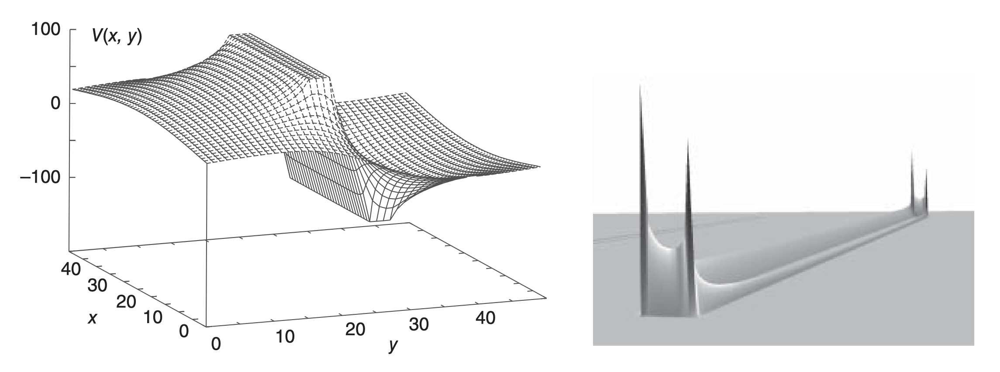

# 项目：有限厚平行板电容器电荷分布分析

## 项目背景

在实际的电容器设计中，平行板电容器的导体板具有有限的厚度，这与理想的无限薄导体板模型存在差异。本项目将研究有限厚度平行板导体电容器中的电荷密度分布特性。

由于平行板电容器是导体，它们在表面仍保持为等势面（+100V和-100V），但现在平行板的厚度至少为 2Δ（Δ为计算步长）。这种几何结构的改变会显著影响电场分布和表面电荷密度的分布模式。

## 学习目标

通过完成本项目，学生将能够：

1. **用有限差分法求解有限厚导体板的电势分布**：使用二维有限差分格式求解二维泊松方程，求解电势分布。
2. **理解泊松方程的应用**：通过 $\nabla^2U(\vec{x})=-4\pi\rho(\vec{x})$ 计算电荷密度分布
4. **可视化电物理场**：使用matplotlib绘制电势分布和电荷密度分布图

## 项目任务

### 任务1：实现雅可比迭代或Gauss-Seidel SOR迭代法求解拉普拉斯方程

实现 `solve_laplace_sor` 函数，使用雅可比迭代或逐次超松弛迭代方法求解二维拉普拉斯方程：

$$\nabla^2 U = \frac{\partial^2 U}{\partial x^2} + \frac{\partial^2 U}{\partial y^2} = 0$$

**边界条件：**
- 上导体板表面：U = +100V
- 下导体板表面：U = -100V  
- 左右边界：U = 0V（接地）
- 导体内部：保持恒定电势

**技术要求：**
- 收敛判据：相邻迭代间最大差值 < 1e-4
- 最大迭代次数：10000次

### 任务2：计算表面电荷密度分布

实现 `calculate_charge_density` 函数，通过泊松方程计算电荷密度：

$$\rho(x,y) = -\frac{1}{4\pi}\nabla^2 U(x,y)$$

建议使用 `scipy.ndimage.laplace` 函数计算拉普拉斯算子，或自行实现中心差分格式。

### 任务3：结果可视化与分析

实现 `plot_results` 函数，生成以下可视化图表：

1. **电势分布等高线图**：显示电场线和等势线
2. **表面电荷密度分布**：沿导体表面的电荷密度变化

## 技术要求

### 编程规范
- 使用Python 3.8+
- 主要依赖：numpy, scipy, matplotlib
- 遵循PEP 8代码风格
- 函数需要完整的文档字符串

### 数值方法要求
- 网格分辨率：至少100×100
- 数值精度：双精度浮点数
- 边界处理：正确实现Dirichlet边界条件

### 物理合理性检验
- 电势分布应满足拉普拉斯方程
- 导体表面为等势面
- 电荷主要分布在导体表面

## 提示与资源

### 算法提示
1. **网格设置**：使用均匀矩形网格，注意边界点的特殊处理
2. **SOR优化**：最优松弛因子通常在1.8-1.95之间
3. **边界条件**：导体内部保持固定电势
4. **数值微分**：使用中心差分提高精度

### 扩展思考
1. 不同厚度对电荷分布的影响
2. 与解析解的对比分析
3. 三维情况的扩展

## 提交要求

1. **代码文件**：完成 `finite_thickness_capacitor_student.py` 中所有函数实现
2. **实验报告**：填写 `实验报告.md`，包含算法说明、结果分析和思考总结
3. **运行结果**：确保代码能够正常运行并生成正确的可视化结果
4. **代码测试**：通过所有单元测试用例
