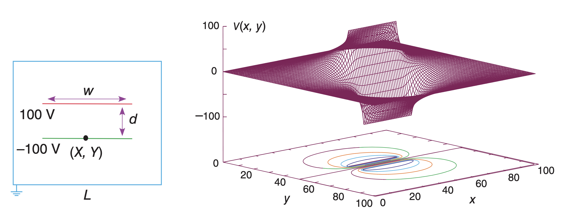

# 项目：平行板电容器电势分布模拟

## 项目背景

在静电学中，电势分布是理解电场行为的关键。对于一个没有自由电荷的区域，电势满足拉普拉斯方程 (∇²V = 0)。本项目模拟一个放在接地箱中的平行板电容器，箱子足够大，不影响电容器附近的电场。两个平行板很薄，上下板的电压分别为100V和-100V。

*示意图：放置在接地箱中的平行板电容器。上下板分别带电，箱壁接地。*

本项目的目标是利用数值方法求解拉普拉斯方程，模拟平行板电容器内部的电势分布，比较不同迭代算法的收敛速度和计算时间，并可视化电势分布、等势线和电场线。

## 学习目标

*   理解拉普拉斯方程在静电学中的应用和边界条件设置。
*   掌握Jacobi迭代法和Gauss-Seidel SOR迭代法求解偏微分方程的原理。
*   学会比较不同数值算法的收敛性能和计算效率。
*   使用Python（Numpy和Matplotlib）进行科学计算和结果可视化。
*   培养分析物理问题和设计数值算法的能力。

## 项目任务

请在 `parallel_plate_capacitor_student.py` 文件中实现以下函数，模拟平行板电容器的电势分布：

### 主要任务：

1.  **实现 `solve_laplace_jacobi` 函数：**
    *   使用Jacobi迭代法求解拉普拉斯方程
    *   迭代公式： $U_{i,j} = \frac{1}{4}(U_{i+1,j} + U_{i-1,j} + U_{i,j+1} + U_{i,j-1})$
    *   返回电势分布和迭代次数

2.  **实现 `solve_laplace_sor` 函数：**
    *   使用Gauss-Seidel SOR（逐次超松弛）迭代法
    *   迭代公式： $u_{i,j} = (1-\omega)u_{i,j} + \omega r_{i,j}$
    *   其中 $r_{i,j} = \frac{1}{4}(u_{i+1,j} + u_{i-1,j} + u_{i,j+1} + u_{i,j-1})$
    *   松弛因子建议取值 $\omega = 1.25$ 到 $1.8$
    *   返回电势分布、迭代次数和收敛变化量

3.  **实现 `plot_results` 函数：**
    *   绘制三维电势分布图（线框图）
    *   绘制等势线投影图
    *   可选：绘制电场线（流线图）

### 具体要求：

1.  **初始化网格：** 创建二维网格表示模拟区域，初始化电势为零。
2.  **设置边界条件：**
    *   接地箱边界： $U(0, y) = 0$, $U(L, y) = 0$, $U(x, 0) = 0$, $U(x, L) = 0$
    *   平行板电势：上板 = 100V，下板 = -100V
3.  **迭代求解：** 实现两种算法并比较性能
4.  **收敛判断：** 当电势变化量小于容差时停止迭代
5.  **性能分析：** 记录并比较两种方法的收敛速度和计算时间

## 技术要求

*   **编程语言：** Python 3
*   **所需库：** `numpy` 用于数值计算，`matplotlib` 用于结果可视化，`time` 用于性能测试
*   **函数签名：** 必须严格遵循以下函数签名：
    *   `solve_laplace_jacobi(xgrid, ygrid, w, d, tol=1e-5)` - Jacobi迭代法
    *   `solve_laplace_sor(xgrid, ygrid, w, d, omega=1.25, Niter=1000)` - SOR迭代法
    *   `plot_results(x, y, u, method_name)` - 结果可视化

## 提示与资源

*   **Jacobi迭代法：** 在每次迭代中，需要一个旧的电势网格副本 (`u_old = u.copy()`) 来计算新的电势值，避免在同一迭代中混用新旧值。
*   **Gauss-Seidel SOR迭代法：** 直接在原网格上更新电势值，新计算的值立即用于后续点的计算，通常收敛更快。松弛因子 $\omega$ 的选择影响收敛速度。
*   **边界条件处理：** 在迭代循环中正确跳过或重新设置边界上的电势值。
*   **平行板位置计算：** 
    *   `xL = (xgrid-w)//2`  # 左侧坐标
    *   `xR = (xgrid+w)//2`  # 右侧坐标  
    *   `yB = (ygrid-d)//2`  # 下板坐标
    *   `yT = (ygrid+d)//2`  # 上板坐标
*   **可视化技巧：**
    *   使用 `ax.plot_wireframe()` 绘制三维线框图
    *   使用 `ax.contour()` 绘制等势线投影
    *   使用 `plt.streamplot()` 绘制电场线
*   **电场计算：** `EY, EX = np.gradient(-u, 1)` 计算电场分量(注意顺序)

## 参考资源

*   **拉普拉斯方程：** $\frac{\partial^2U}{\partial x^2} + \frac{\partial^2U}{\partial y^2} = 0$
*   **边界条件：** 接地箱四周电势为零，平行板电势分别为±100V
*   **Jacobi迭代：** 使用前一步的所有值计算当前步
*   **SOR迭代：** 使用当前步已更新的值和松弛因子加速收敛
*   **收敛判断：** 通常使用最大绝对变化量或平均变化量作为收敛标准
