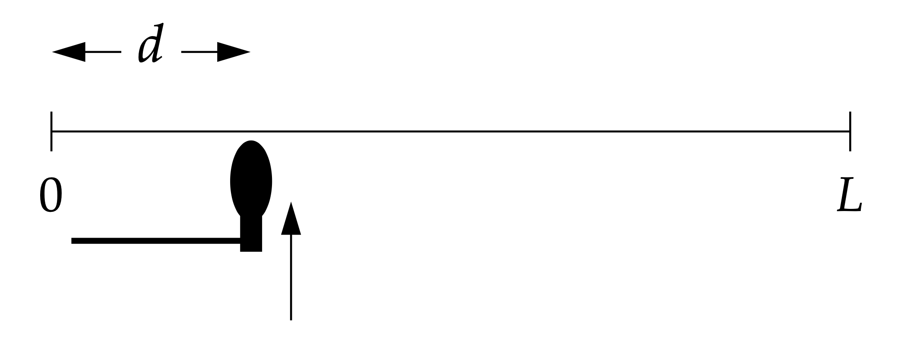

# 项目：波动方程的FTCS解

## 项目背景

本项目的目标是使用有限差分法（Finite Difference Method, FDM）中的FTCS（Forward-Time Central-Space）方案来模拟一维波动方程，例如钢琴弦的振动。波动方程是物理学中描述波传播现象的基本方程，通过数值方法求解可以帮助我们理解波的动态行为。

## 学习目标

*   理解一维波动方程的物理意义及其在弦振动中的应用。
*   掌握FTCS有限差分方案的原理和实现细节。
*   学习如何处理初始条件和边界条件在数值模拟中的应用。
*   熟悉使用Python（特别是NumPy和Matplotlib）进行科学计算和数据可视化。
*   能够创建动态模拟动画，直观展示物理过程。

## 项目任务

考虑一根长度为 $L$ 的弦，在 $t=0$ 时刻处于静止状态，但被施加了一个初始速度剖面。你需要编写一个Python程序来模拟这根弦的振动。

1.  **实现波动方程的FTCS解法：**

*   波动方程为：
    
$$ \frac{\partial^2 u}{\partial t^2} = v^2 \frac{\partial^2 u}{\partial x^2} $$

其中 $u(x, t)$ 是弦在位置 $x$ 和时间 $t$ 的位移， $v$ 是波速。

*   使用FTCS方案离散化方程。离散化后的更新公式为：
    
$$ u_{i,j+1} = c(u_{i+1,j} + u_{i-1,j}) + 2(1-c)u_{i,j} - u_{i,j-1} $$

其中 $c = v^2 \frac{(\Delta t)^2}{(\Delta x)^2}$。请注意，为了数值稳定性，通常要求 $c < 1$。
    
*   **初始条件：**
        
    *   初始位移： $u(x, 0) = 0$ (弦开始时静止在平衡位置)。
    *   初始速度： $\frac{\partial u}{\partial t}(x, 0) = \psi(x)$，其中 $\psi(x)$ 的轮廓为：
        
$$ \psi(x) = C \frac{x(L-x)}{L^2} \exp \left[ -\frac{(x-d)^2}{2\sigma^2} \right] $$

对于第一个时间步 $u_{i,1}$ 的计算，可以使用以下公式（当 $u_{i,0}=0$ 时简化）：
            
$$ u_{i,1} = \psi(x_i) \Delta t $$

或者更通用的形式（如果 $u_{i,0}$ 不为零）：
        
$$ u_{i,1} = \frac{c}{2}(u_{i+1,0} + u_{i-1,0}) + (1-c)u_{i,0} + \psi(x_i)\Delta t $$

请根据 $u(x,0)=0$ 的条件选择合适的简化形式。

*   **边界条件：** 弦的两端固定，即 $u(0, t) = 0$ 和 $u(L, t) = 0$。
*   **参数设置：**
    *   波速 $v = 100 \,\mathrm{m\cdot s}^{-1}$
    *   弦长 $L = 1 \,\mathrm{m}$
    *   初始速度剖面参数： $d = 0.1 \,\mathrm{m}$ (10 cm), $C = 1 \,\mathrm{m\cdot s}^{-1}$, $\sigma = 0.3 \,\mathrm{m}$
    *   建议的空间步长 $\Delta x = 0.01 \,\mathrm{m}$
    *   建议的时间步长 $\Delta t = 5 \times 10^{-5} \,\mathrm{s}$ (请验证 $c < 1$)

2.  **创建弦运动的动画：**
    *   使用 `matplotlib.animation.FuncAnimation` 创建一个动画，展示弦随时间振动的过程。
    *   动画应清晰地显示弦的形状变化。

## 技术要求

*   使用Python 3编程。
*   主要使用 `NumPy` 进行数值计算。
*   使用 `Matplotlib` 进行绘图和动画制作。
*   代码应遵循PEP 8规范，并有适当的注释。
*   函数 `u_t` 和 `solve_wave_equation_ftcs` 的签名必须与学生模板 `wave_equation_ftcs_student.py` 中的定义完全一致。

## 提示与资源

*   **稳定性条件：** 确保你的 $\Delta t$ 和 $\Delta x$ 满足 $v \frac{\Delta t}{\Delta x} < 1$ (即 $c < 1$)，否则数值解可能会发散。
*   **边界条件处理：** 在迭代过程中，始终保持 $u_{0,j}$ 和 $u_{N_x,j}$ 为零。
*   **动画制作：** `FuncAnimation` 需要一个更新函数，该函数接受帧数作为参数，并更新绘图数据。
*   **参考资料：**
    *   计算物理教材中关于有限差分法求解波动方程的章节。
    *   NumPy和Matplotlib官方文档。
