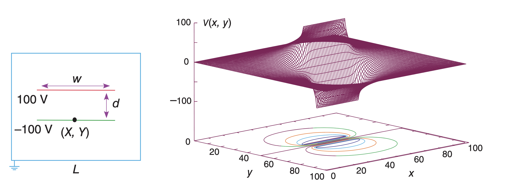

如图，左图是放在接地箱中的一个平行板电容器，箱子足够大，不影响电容器附近的磁场。右图是电势分布的数值解，下面x,y平面上的投影是等势线。



假设两个平行板很薄，上下板上的电压如图所示。用雅可比迭代法和Gauss-Seidel SOR迭代法解拉普拉斯方程，比较两种算法的收敛速度和计算时间，画出如右图所示的电势分布和等势线。（在平行板电容器处的电压值分别为100V和-100V）

### 参考答案
### 解: Laplace迭代法

平行板电容器的拉普拉斯方程为

$$\frac{\partial^2U}{\partial x^2} + \frac{\partial^2U}{\partial y^2} = 0$$

在接地箱上的边界条件

$$U(0, y) = 0, U(L, y) = 0$$

$$U(x, 0) = 0, U(x, L) = 0$$

拉普拉斯方程的迭代公式为

$$U_{i,j}=\frac{1}{4}(U_{i+1,j}+U_{i-1,j}+U_{i,j+1}+U_{i,j-1})$$

```python
def Laplace_iterate(xgrid,ygrid,w,d,tol=1e-5):
    """
    Iterate algrithm for Laplace equation
    ------------
    I, J: the total steps in x and y direction
    w: the width of the plates
    d: the distance between the plates
    """
    u = np.zeros((xgrid,ygrid))
       
    #平行板电容器的位置
    xL = (xgrid-w)//2  #平行板电容器左侧坐标
    xR = (xgrid+w)//2  #平行板电容器右侧坐标
    yB = (ygrid-d)//2  #下侧平行板电容器坐标
    yT = (ygrid+d)//2  #上面平行板电容器坐标
    
    deltaV=1.0
    while deltaV>tol: #迭代法
        uold = np.copy(u)
        u[1:-1,1:-1] = 0.25*(u[2:,1:-1] + u[:-2,1:-1] 
                           + u[1:-1, 2:] + u[1:-1,:-2]) #Laplace方程迭代公式
        
        #re-establish the set potential of the plates
        u[xL:xR,yB]=-100 
        u[xL:xR,yT]=100
        #track the change in the matrix at each step to know when to quit
        deltaV=np.max(np.abs(u-uold))
    
    return u
I = J = 100
L = 100
w=40
d=30
x,y = np.mgrid[0:L:I*1j,0:L:J*1j] #x,y坐标
u = Laplace_iterate(I,J,w,d)
fig = plt.figure()
ax = fig.add_subplot(111, projection='3d')
ax.plot_wireframe(x, y, u, rstride=5, cstride=5, color='b') #画线图
levels =np.linspace(u.min(),u.max(),10)  #产生等值线的数值
ax.contour(x, y, u, zdir = 'z', offset = u.min(),levels = levels) #三维投影到2维的等值线
ax.set_title('Jacobi Iterate')
```

#### 拉普拉斯方程的超松驰迭代法
迭代公式: $$u_{i,j}=(1-\omega)u_{i,j}+\omega r_{i,j}$$
其中
$$r_{i,j}=\frac{1}{4}(u_{i+1,j}+u_{i-1,j}+u_{i,j+1}+u_{i,j-1})$$
这里的松弛因子$\omega=1.8$.


```python
def Laplace_SOR(xgrid,ygrid,w, d, Niter=1000):
    """
    The succesive overrelaxation iteration
    ------------
    xgrid, ygrid: the total steps in x and y direction
    """
    u = np.zeros((xgrid,ygrid))
    
    #平行板电容器的位置
    xL = (xgrid-w)//2 
    xR = (xgrid+w)//2
    yB = (ygrid-d)//2
    yT = (ygrid+d)//2
    
    omega = 1.25 #松弛因子
    for k in range(Niter): 
        uold = np.copy(u)
        for i in range(1,xgrid-1):
            for j in range(1, ygrid-1):
                uh = u[i+1,j] + u[i-1,j] + u[i,j+1] + u[i, j-1]
                u[i,j] = (1-omega)*u[i,j] + 0.25*omega*uh #超松弛迭代公式
        
        #re-establish the set potential of the plates
        u[xL:xR,yB]=-100
        u[xL:xR,yT]=100
        
        #track the change in the matrix at each step to know when to quit
        deltaV=u-uold;
        change=abs(sum(sum(deltaV))/(xgrid*ygrid));
    
        #%conditional to quit the method when changes are within tolerance
        if k>1000 and change<1e-5: break
    return u,k,change
%matplotlib inline
I = J = 100
L = 100
w=60
d=20
x,y = np.mgrid[0:L:I*1j,0:L:J*1j] #x,y坐标
u,k,c = Laplace_SOR(I,J,w,d)
print('k=',k, 'c=',c)
fig = plt.figure()
ax = fig.add_subplot(111, projection='3d')
ax.plot_wireframe(x, y, u, rstride=5, cstride=5, color='r')
levels =np.linspace(u.min(),u.max(),20)
ax.contour(x, y, u, zdir = 'z', offset = u.min(),levels = levels)
ax.set_title('Gauss-Seidel SOR Iterate')
```

 ### 画电场线

 ```python
 EX, EY=np.gradient(-u,1)
plt.contour(x, y, u,levels = levels)
#plt.quiver(x,y,EX,EY, scale=2000)
plt.streamplot(x.T,y.T, EX.T, EY.T, linewidth=1,cmap='rainbow',density=2, arrowstyle='->', arrowsize=1.5) #线性流形
```